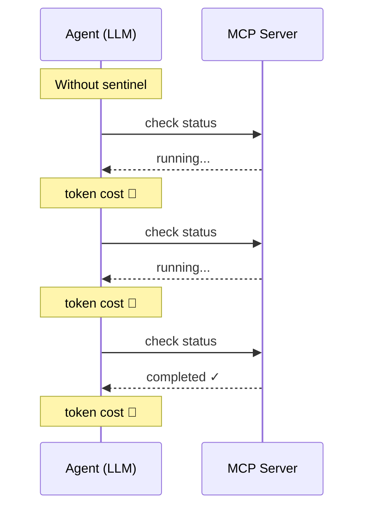
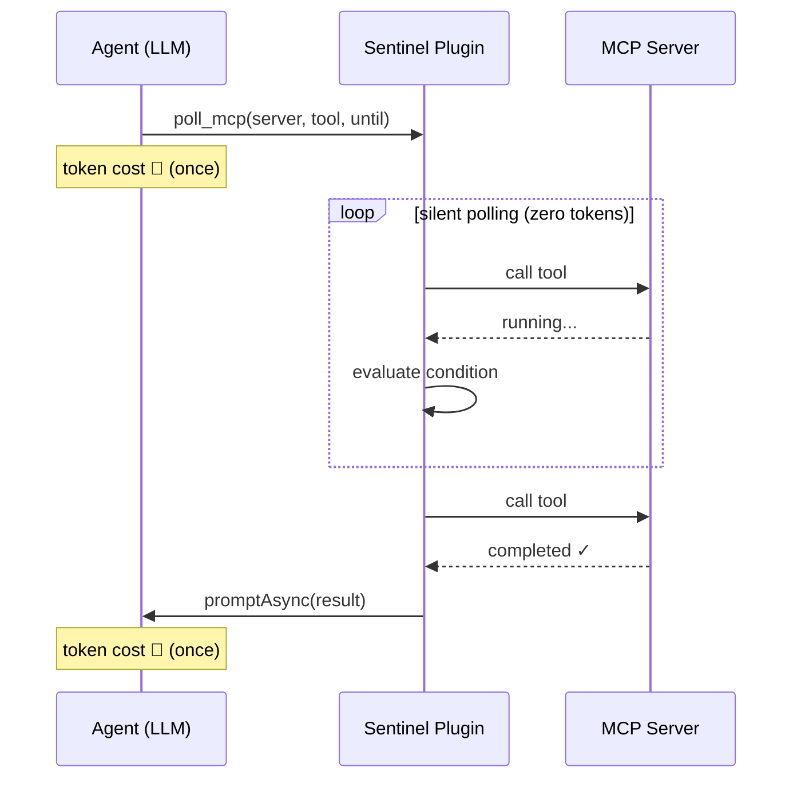
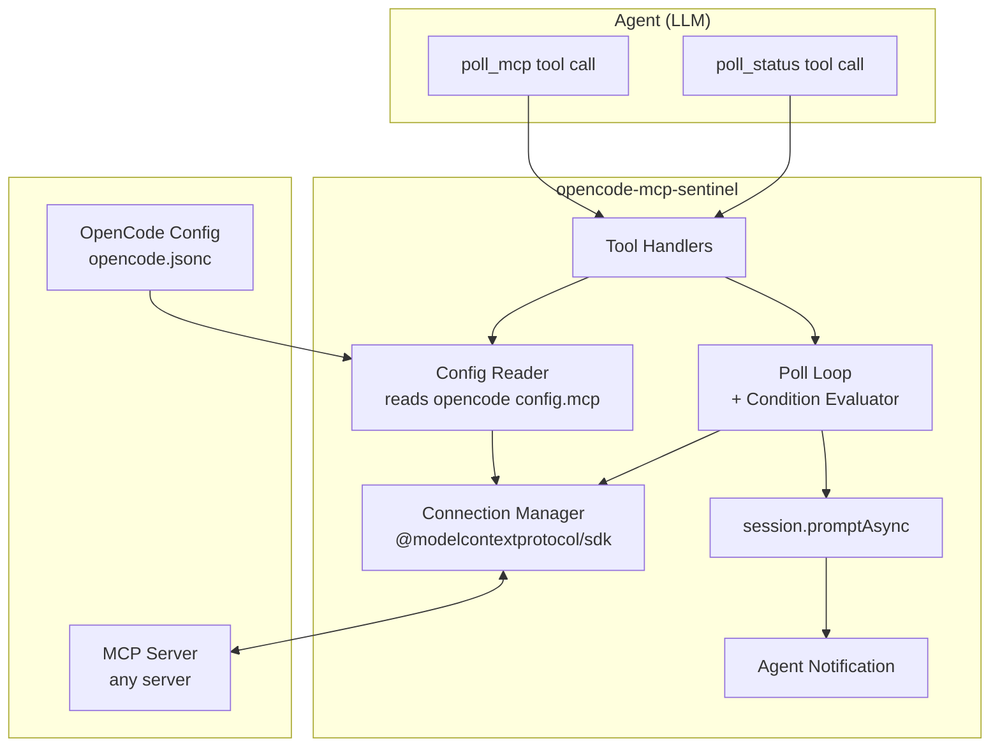
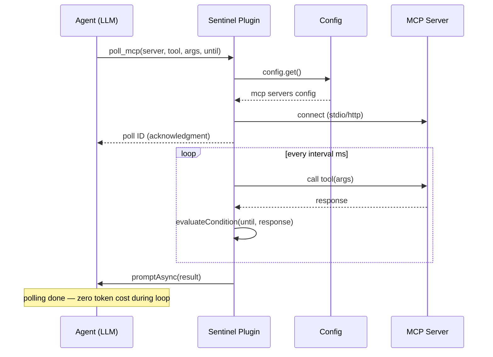

# opencode-mcp-sentinel

A plugin for [OpenCode](https://opencode.ai) that acts as a **sentinel** between the AI agent and MCP servers — polling long-running tasks on the agent's behalf so that token-costly status loops never enter the LLM inference path.

## Motivation

When an agent submits a long-running job through an MCP tool, it must repeatedly call the server to check progress — each round-trip burns context window tokens.



**opencode-mcp-sentinel** moves the polling loop out of the agent and into the plugin runtime — 2 inference calls regardless of task duration.



## Installation

**Method 1 — CLI**

```bash
opencode plugin -g opencode-mcp-sentinel
```

**Method 2 — Manual**

Add to your `opencode.jsonc` (project-level `.opencode/opencode.jsonc` or global `~/.config/opencode/opencode.jsonc`):

```jsonc
{
  "plugin": ["opencode-mcp-sentinel"],
}
```

The plugin reads your existing MCP server configs — no additional setup needed.

## Tools

### `mcp_sentinel_poll`

Submit a long-running MCP tool call and poll it at regular intervals until a condition is met. The sentinel polls silently (zero token cost) and notifies you when done.

| Parameter  | Type   | Default    | Description                                |
| ---------- | ------ | ---------- | ------------------------------------------ |
| `server`   | string | _required_ | MCP server name (from opencode config)     |
| `tool`     | string | _required_ | Tool name to call on the server            |
| `args`     | string | `"{}"`     | JSON string of arguments for the tool      |
| `interval` | number | `5000`     | Poll interval in milliseconds              |
| `timeout`  | number | _optional_ | Max poll duration in ms (unset = no limit) |
| `until`    | string | _required_ | JSON condition object                      |

Returns a sentinel ID immediately. Agent is notified via `promptAsync` when done.

### `mcp_sentinel_status`

Check the status of sentinel tasks, list active tasks, or cancel a running task.

| Parameter | Type                                 | Description                                      |
| --------- | ------------------------------------ | ------------------------------------------------ |
| `action`  | `"status"` \| `"list"` \| `"cancel"` | Action to perform                                |
| `id`      | string                               | Sentinel ID (required for `status` and `cancel`) |

### `mcp_sentinel_attach`

Block the agent, waiting for a sentinel task to complete. Sleeps and checks status internally with zero token cost. If cancelled via `ctx.abort`, the background async notification still fires normally.

| Parameter | Type   | Default    | Description                                     |
| --------- | ------ | ---------- | ----------------------------------------------- |
| `id`      | string | _required_ | Sentinel ID to wait for                         |
| `timeout` | number | _optional_ | Max wait time in ms (unset = wait indefinitely) |

### `mcp_sentinel_read`

Read raw poll outputs from a sentinel task. Useful for debugging when a condition isn't matching — inspect actual MCP responses. Supports range-based pagination via `offset`.

| Parameter | Type   | Default    | Description                             |
| --------- | ------ | ---------- | --------------------------------------- |
| `id`      | string | _required_ | Sentinel ID to read outputs from        |
| `offset`  | number | `end-N`    | 0-based start index (default: from end) |
| `limit`   | number | `5`        | Max number of outputs to return         |

## Condition Model

Conditions are **pure declarative data** — no executable code, no injection surface.

```typescript
// Simple comparison
{ "path": "status", "is": "eq", "value": "completed" }

// Array index access
{ "path": "[0].data.path", "is": "eq", "value": "found" }

// Regex match
{ "path": "log", "is": "match", "value": "^error" }

// Logical composition
{
  "and": [
    { "path": "status", "is": "eq", "value": "completed" },
    { "path": "tasks[0].exit_code", "is": "eq", "value": 0 }
  ]
}
```

### Operators

| Operator   | Description                                  |
| ---------- | -------------------------------------------- |
| `eq`       | Strict equality                              |
| `ne`       | Not equal                                    |
| `gt`       | Greater than (numeric)                       |
| `gte`      | Greater than or equal                        |
| `lt`       | Less than                                    |
| `lte`      | Less than or equal                           |
| `contains` | String contains                              |
| `match`    | Regex match (`new RegExp(value).test(data)`) |

### Logical combinators

| Combinator               | Description    |
| ------------------------ | -------------- |
| `{ "not": <condition> }` | Negation       |
| `{ "and": [...] }`       | All must match |
| `{ "or": [...] }`        | Any must match |

### Path syntax

Uses property-access notation with array index support:

```
status               → obj.status
tasks[0].exit_code   → obj.tasks[0].exit_code
[0].data.path        → obj[0].data.path
items[2].name        → obj.items[2].name
```

## Architecture



### Data Flow



## License

MIT
