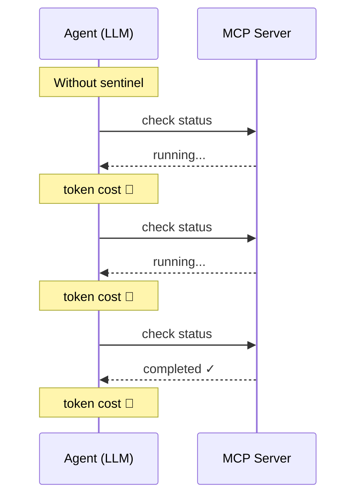
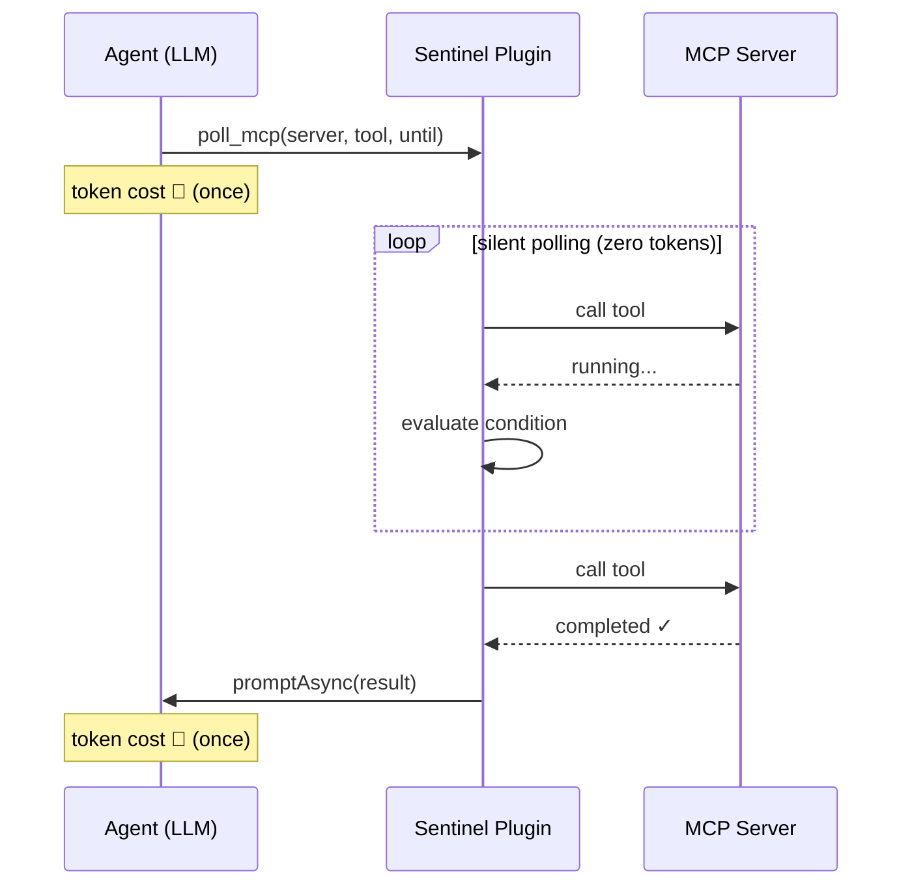
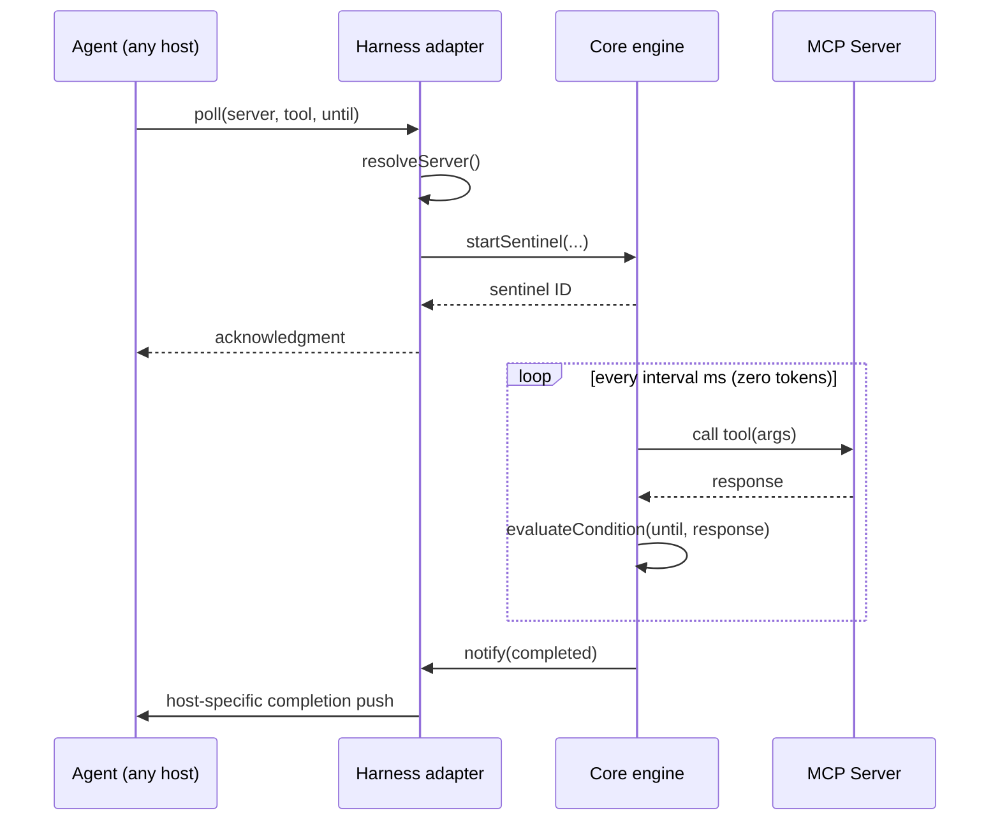

# mcp-sentinel

A **sentinel** between an AI agent and MCP servers — polling long-running tasks on the agent's behalf so that token-costly status loops never enter the LLM inference path.

This is a **monorepo**: a harness-agnostic core (`@gcszhn/mcp-sentinel-core`) plus one thin plugin package per agent host.

## Design principle

**Zero MCP re-configuration.** The sentinel never asks the user to configure MCP
servers of its own. Installing the plugin is the whole setup — it discovers and
reuses the MCP servers the harness already has, in whichever way that harness
exposes them:

- **From the host's MCP config** — OpenCode. The plugin reads
  `client.config.get().mcp` and hands the resolved servers to the core, which
  owns the connection lifecycle. No extra MCP setup.
- **Through the harness SDK** — DeepSeek Harness. The plugin calls the
  `mcp__<server>__<tool>` tools already registered by
  `@deepseek-ai/dsh-mcp-client` via `ctx.tools.execute`. No extra MCP setup.

The agent immediately sees the MCP servers it already configured for that
harness; there is no sentinel-specific MCP config, mock server, or demo wiring
to maintain.

## Supported harnesses

Install instructions and per-harness details live in each plugin's own README.

| Harness          | Plugin package                                                                                                               | Docs                                          |
| ---------------- | ---------------------------------------------------------------------------------------------------------------------------- | --------------------------------------------- |
| OpenCode         | [`@gcszhn/mcp-sentinel-opencode-plugin`](https://www.npmjs.com/package/@gcszhn/mcp-sentinel-opencode-plugin)                 | [README](packages/opencode/README.md)         |
| DeepSeek Harness | [`@gcszhn/mcp-sentinel-deepseek-harness-plugin`](https://www.npmjs.com/package/@gcszhn/mcp-sentinel-deepseek-harness-plugin) | [README](packages/deepseek-harness/README.md) |

The shared core ships separately as [`@gcszhn/mcp-sentinel-core`](https://www.npmjs.com/package/@gcszhn/mcp-sentinel-core) — see [its README](packages/core/README.md).

## Motivation

When an agent submits a long-running job through an MCP tool, it must repeatedly call the server to check progress — each round-trip burns context window tokens.



**mcp-sentinel** moves the polling loop out of the agent and into the plugin runtime — 2 inference calls regardless of task duration.



## Configuration

Environment variables for controlling memory usage:

| Variable                | Default   | Description                                       |
| ----------------------- | --------- | ------------------------------------------------- |
| `SENTINEL_MAX_POLL_LOG` | unlimited | Max poll log entries per task (FIFO trim)         |
| `SENTINEL_TASK_TTL_MS`  | unlimited | Auto-cleanup completed tasks after N milliseconds |

Both accept positive integers only. Zero, negative, or non-numeric values are treated as unlimited/disabled.

## Tools

### `mcp_sentinel_poll`

Submit a long-running MCP tool call and poll it at regular intervals until a condition is met. The sentinel polls silently (zero token cost) and notifies you when done.

| Parameter  | Type   | Default    | Description                                           |
| ---------- | ------ | ---------- | ----------------------------------------------------- |
| `server`   | string | _required_ | MCP server name (resolved from the host's MCP config) |
| `tool`     | string | _required_ | Tool name to call on the server                       |
| `args`     | string | `"{}"`     | JSON string of arguments for the tool                 |
| `interval` | number | `5000`     | Poll interval in milliseconds                         |
| `timeout`  | number | _optional_ | Max poll duration in ms (unset = no limit)            |
| `until`    | string | _required_ | JSON condition object                                 |

Returns a sentinel ID immediately. The agent is notified when done (the delivery mechanism is host-specific).

### `mcp_sentinel_status`

Check the status of sentinel tasks, list active tasks, or cancel a running task.

| Parameter | Type                                 | Description                                      |
| --------- | ------------------------------------ | ------------------------------------------------ |
| `action`  | `"status"` \| `"list"` \| `"cancel"` | Action to perform                                |
| `id`      | string                               | Sentinel ID (required for `status` and `cancel`) |

### `mcp_sentinel_attach`

Block the agent, waiting for a sentinel task to complete. Sleeps and checks status internally with zero token cost. If cancelled via `ctx.abort`, the background async notification still fires normally.

| Parameter | Type   | Default    | Description                                     |
| --------- | ------ | ---------- | ----------------------------------------------- |
| `id`      | string | _required_ | Sentinel ID to wait for                         |
| `timeout` | number | _optional_ | Max wait time in ms (unset = wait indefinitely) |

### `mcp_sentinel_read`

Read raw poll outputs from a sentinel task. Useful for debugging when a condition isn't matching — inspect actual MCP responses. Supports range-based pagination via `offset`.

| Parameter | Type   | Default    | Description                             |
| --------- | ------ | ---------- | --------------------------------------- |
| `id`      | string | _required_ | Sentinel ID to read outputs from        |
| `offset`  | number | `end-N`    | 0-based start index (default: from end) |
| `limit`   | number | `5`        | Max number of outputs to return         |

## Condition Model

Conditions are **pure declarative data** — no executable code, no injection surface.

```typescript
// Simple comparison
{ "path": "status", "is": "eq", "value": "completed" }

// Array index access
{ "path": "[0].data.path", "is": "eq", "value": "found" }

// Regex match
{ "path": "log", "is": "match", "value": "^error" }

// Logical composition
{
  "and": [
    { "path": "status", "is": "eq", "value": "completed" },
    { "path": "tasks[0].exit_code", "is": "eq", "value": 0 }
  ]
}
```

### Operators

| Operator   | Description                                  |
| ---------- | -------------------------------------------- |
| `eq`       | Strict equality                              |
| `ne`       | Not equal                                    |
| `gt`       | Greater than (numeric)                       |
| `gte`      | Greater than or equal                        |
| `lt`       | Less than                                    |
| `lte`      | Less than or equal                           |
| `contains` | String contains                              |
| `match`    | Regex match (`new RegExp(value).test(data)`) |

### Logical combinators

| Combinator               | Description    |
| ------------------------ | -------------- |
| `{ "not": <condition> }` | Negation       |
| `{ "and": [...] }`       | All must match |
| `{ "or": [...] }`        | Any must match |

### Path syntax

Uses property-access notation with array index support:

```
status               → obj.status
tasks[0].exit_code   → obj.tasks[0].exit_code
[0].data.path        → obj[0].data.path
items[2].name        → obj.items[2].name
```

## Architecture

The project is a **monorepo** where each layer ships as its own npm package. The
core knows nothing about any host; every harness is a thin, self-contained
package layered on top of it.

### Layers

| Package                       | Purpose                                                                                  | Published as                            |
| ----------------------------- | ---------------------------------------------------------------------------------------- | --------------------------------------- |
| `packages/core`               | sentinel engine, tool handlers, condition evaluator, connection pool, env, logger, types | `@gcszhn/mcp-sentinel-core`             |
| `packages/opencode`           | OpenCode adapter: `tool()` definitions + `client.config.get()` + `session.promptAsync`   | `@gcszhn/mcp-sentinel-opencode-plugin`  |
| `packages/<harness>` (future) | one entry per host, e.g. `codex`, `claude-code`, `deepseek`                              | `@gcszhn/mcp-sentinel-<harness>-plugin` |

### Core / harness contract

The core exposes one **uniform seam** — `ServerResolver` — so each harness can
plug in its own config source and notification channel without the core knowing
which host it is running under.

```ts
// core — the uniform interface (harness-agnostic)
type ServerResolver = (name: string) => McpServerConfig | null;

// the core engine accepts a resolver instead of reading host config itself
startSentinel(request, resolveServer: ServerResolver): Promise<string>;
```

**MCP config discovery is the harness's job** — different hosts fetch it
differently (OpenCode via `client.config.get().data` `mcp.*` flat keys, Codex
via `config.toml` + `.mcp.json`, …). The harness normalizes its raw config into
the core's `McpConfig`, builds a `ServerResolver` with `makeServerResolver`,
and hands it to the engine.

The harness also owns the two host-specific seams the core has no opinion on:

```ts
interface Harness {
  registerTools(): void; // expose the 4 tools in the host's tool system
  resolveServer(name: string): McpServerConfig | null; // config discovery (harness-side)
  notify(task: SentinelTask, event: SentinelEvent): void; // completion push via the host's message channel
}
```

### Adding a new harness

0. **Develop it in its own git worktree** — a new harness plugin is isolated
   from the core and from other harnesses; see `AGENTS.md`.
1. Create `packages/<harness>/package.json` named `@gcszhn/mcp-sentinel-<harness>-plugin`
   with a dependency on `@gcszhn/mcp-sentinel-core`.
2. Parse the host's MCP config into a `McpConfig` (harness-specific).
3. Register the four tools, delegating to the core's `handlePoll` /
   `handleStatus` / `handleAttach` / `handleRead` handlers.
4. Implement the notifier via the host's message channel (e.g. OpenCode
   `promptAsync`).

### Data flow (core)



### Layout

```
packages/
  core/                         # @gcszhn/mcp-sentinel-core (zero host deps)
    src/
      engine.ts                 # startSentinel / cancel / getTask / getActive / cleanup
      tools.ts                  # handlePoll / handleStatus / handleAttach / handleRead
      condition.ts              # condition evaluator
      connection-pool.ts        # MCP client pool (@modelcontextprotocol/sdk)
      env.ts                    # SENTINEL_* env
      logger.ts                 # pluggable sink
      resolver.ts               # makeServerResolver (McpConfig → ServerResolver)
      types.ts                  # McpServerConfig / ServerResolver / Sentinel*
      index.ts                  # public barrel
    tests/
  opencode/                     # @gcszhn/mcp-sentinel-opencode-plugin
    src/
      plugin.ts                 # PluginModule entry
      index.ts                  # tool() definitions + promptAsync notifier
      config.ts                 # parseOpencodeMcpConfig (opencode `mcp` block) → McpConfig
    tests/
  # future harnesses, one concrete package each:
  #   codex/   claude-code/   deepseek/   ...
```

> **Build order**: each package builds independently, but the OpenCode package
> type-checks and runs against `@gcszhn/mcp-sentinel-core`'s published `dist/`. Run
> `bun run build` (core first, then opencode) before `bun test`.

## License

MIT
